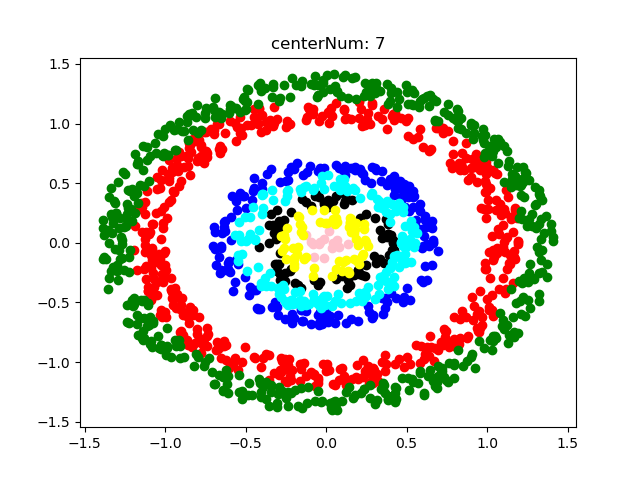

# HUST-EIC-MathematicalModeling
电信提高班独有的数学建模课程代码（2021版）

---

- 这个课可能只有电信提高班的有了，代码是本人自己写的，少部分参考了同学的。由于老师推荐matlab写代码，但是本人在处理简单数据和编程都喜欢python，因此后期有无matlab版本要看有无好心人帮助建设仓库了。
- 部分代码使用同学的，一些封装和代码风格并不完善，有一些问题可以及时反馈。联系本人
- 不要强求代码很好看或者算法和优秀，这门课目的不是纯编程课

---

## 作业说明：

1. **Lesson1**

   2个作业部分，分别在两个压缩包。华容道自己闲的用java、C++、py各写了一遍，但是都没怎么优化算法

2. **Lesson2**

   Euler法解方程时，递推公式需要一直改的，交完作业懒得动了，有兴趣的同学自行添加功能实现封装，以使得每次运行不需要都重新改代码（在Euler.py 23行）。

3. **Lesson3**

   直接用lingo求解的，其他做法看其他同学提不提供了

4. **Lesson4**

   matlab写的，把三个题都写在一个文件了，用提示信息指示不同题目

5. **Lesson5**

   前4题是[这位同学](https://github.com/lujzz)提供的，本人主要写了最后一题聚类，可以修改聚类中心，但是颜色指定我没有shuffle，指定了9个颜色，因此超过9个聚类中心会崩盘。运行程序控制台输出是每次迭代的聚类中心点，最后的图是效果。

   

---

## 注

1. 用爱发电，出现错误别抱怨本人
2. 求star和follow
3. **大学的课程不同人看待角度不一样，请使用代码的人不要认为提供这样一个途径是我们应该的**